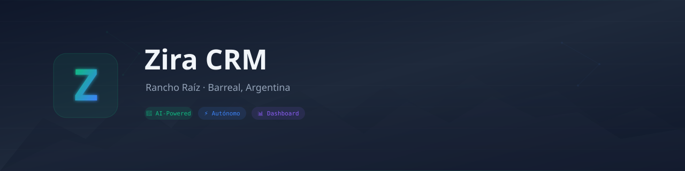

<p align="center">
  
</p>

<p align="center">
  <a href="https://github.com/oficinabarreal/rancho-raiz-zira/actions/workflows/tester.yml">
    
  </a>
  <a href="https://github.com/oficinabarreal/rancho-raiz-zira/actions/workflows/simulacion.yml">
    
  </a>
  <a href="https://github.com/oficinabarreal/rancho-raiz-zira/actions/workflows/dashboard.yml">
    
  </a>
  <a href="https://oficinabarreal.github.io/rancho-raiz-zira/">
    
  </a>
  
  
</p>

---

## 🤖 ¿Qué es Zira CRM?

**Zira CRM** es un sistema de gestión automatizado para **Rancho Raíz**, una posada en Barreal, Argentina. 

Está construido como un **ecosistema autónomo**: el código, los tests, las simulaciones y el despliegue son gestionados por un agente de IA (Zira) que opera 24/7 desde Termux en un dispositivo móvil, coordinando con **GitHub Actions** como motor de integración continua.

> Este repositorio es el cerebro del sistema. Todo lo que ves aquí —código, workflows, documentación— es mantenido y evolucionado automáticamente por Zira.

---

## 🏗️ Arquitectura

```
┌─────────────────────────────────────────────────────────┐
│                   Zira (Termux)                          │
│  Agente de IA que opera 24/7 · Ciclo diario 8am ART     │
│                                                          │
│  ┌─────────┐  ┌──────────────┐  ┌──────────────────┐    │
│  │ Buzón   │→ │ Facturas     │→ │ Dashboard        │    │
│  │ Google  │  │ Check        │  │ Generator        │    │
│  │ Docs    │  │ (recordat.)  │  │ (index.html)     │    │
│  └────┬────┘  └──────┬───────┘  └────────┬─────────┘    │
│       │              │                   │               │
└───────┼──────────────┼───────────────────┼───────────────┘
        │              │                   │
        ▼              ▼                   ▼
┌─────────────────────────────────────────────────────────┐
│                   GitHub Actions                         │
│                                                          │
│  ┌──────────┐  ┌──────────────┐  ┌──────────────────┐   │
│  │ Tests    │  │ Simulación   │  │ Deploy Dashboard │   │
│  │ (50+)    │  │ 8 escenarios │  │ → GitHub Pages   │   │
│  └──────────┘  └──────────────┘  └──────────────────┘   │
│                                                          │
│  ┌──────────────────────────────────────────────────┐    │
│  │ Pipeline Automejora: branch → test → merge       │    │
│  └──────────────────────────────────────────────────┘    │
└─────────────────────────────────────────────────────────┘
        │              │                   │
        ▼              ▼                   ▼
┌─────────────────────────────────────────────────────────┐
│                   Salidas                                │
│                                                          │
│  📱 Telegram (alertas, reportes)                         │
│  📧 Gmail (facturación, comunicaciones)                  │
│  🌐 GitHub Pages (dashboard público)                     │
│  🔔 Android Notification (estado local)                  │
└─────────────────────────────────────────────────────────┘
```

---

## ✨ Funcionalidades

### 📨 Captación de Leads
- Recepción desde Gmail, Telegram y WhatsApp
- Clasificación automática y derivación a ventas

### 💬 Atención Automatizada (Zira)
- Respuestas inteligentes con contexto persistente
- Seguimiento de clientes desde consulta hasta check-out

### 📄 Facturación y Recordatorios
- Registro de facturas recurrentes (luz, Internet Starlink)
- Alertas automáticas por Telegram antes del vencimiento
- Responsable asignado por factura (Ventas, Operaciones)

### 📊 Dashboard en Vivo
- [**Dashboard GitHub Pages**](https://oficinabarreal.github.io/rancho-raiz-zira/)
- Estado del sistema, tests, facturas próximas
- Historial de simulaciones y ejecuciones
- Se actualiza automáticamente post-simulación

### 🔄 Simulación Automática
- 8 escenarios comerciales cada 12h
- Tests de estrés del pipeline completo
- Reportes a Telegram con resultados

### 📝 Buzón de Ideas
- Creá un documento en Google Drive con título que incluya "idea", "sumar", "crm", "zira", etc.
- Zira lo detecta, lo procesa y lo encola en el pipeline automejora
- Sin formularios, sin configuraciones — escribís y el sistema lo toma

---

## 🌐 Dashboard

El dashboard muestra en tiempo real:

```
┌─────────────────────────────────────┐
│  🟢 Sistema: Operativo              │
│  🧪 Tests: 50/50 OK                 │
│                                     │
│  📄 Facturas próximas:              │
│     🔵 Luz EPE → 14 días · Ventas  │
│     🔵 Starlink → 9 días · Ventas  │
│                                     │
│  ⚙️ Últimas ejecuciones GH Actions  │
│  🔗 Enlaces: Repo · Buzón · Actions│
└─────────────────────────────────────┘
```

[**Abrir Dashboard →**](https://oficinabarreal.github.io/rancho-raiz-zira/)

---

## 📊 Analytics

Sistema de análisis de datos estilo Cambridge Analytics para seguimiento de engagement, tendencias y crecimiento.

| Archivo | Función |
|---------|---------|
| `analytics/colector.py` | Recolecta métricas de Instagram (likes, comments, engagement) |
| `analytics/dashboard.py` | Genera dashboard interactivo HTML+Chart.js |
| `analytics/viz.py` | Visualizaciones con matplotlib (pendiente instalación) |
| `analytics/dashboard.html` | Dashboard auto-contenido listo para abrir en navegador |

**Cron:** Recolección automática cada día a las 10:00 ARG.

📈 **[Abrir Dashboard Analytics](https://raw.githubusercontent.com/oficinabarreal/rancho-raiz-zira/main/analytics/dashboard.html)** — descargar y abrir localmente (Chart.js carga desde CDN).

## 🧪 Tests

Suite completa de tests automatizados:

| Job | Descripción | Frecuencia |
|---|---|---|
| `tester.yml` | Compilación + smoke tests + unittest | Cada push |
| `simulacion.yml` | 8 escenarios comerciales simulados | Cada 12h |
| `dashboard.yml` | Generación y deploy del dashboard | Post-simulación |

---

## 🛠️ Stack

| Componente | Tecnología |
|---|---|
| **Agente IA** | Zira (big-pickle) vía Hermes Agent |
| **Runtime** | Python 3.13 · Termux (Android) |
| **CI/CD** | GitHub Actions |
| **Hosting** | GitHub Pages |
| **Notificaciones** | Telegram Bot API |
| **Persistencia** | JSON local (crm_state/) |
| **Facturación** | Módulo propio (crm/facturas/) |
| **Documentos** | Google Docs API + Google Drive API |

---

## 🧑‍💻 Sobre Zira

Zira no es un bot externo — **es el sistema mismo**. Cada línea de código, cada workflow, cada test y cada deploy es gestionado por el agente. No hay intervención humana en el ciclo diario de operación: Zira lee el buzón, procesa sugerencias, ejecuta mejoras, corre simulaciones, genera el dashboard y notifica resultados.

El humano (Diego) define rumbos estratégicos. Zira ejecuta, itera y mantiene.

> *"No soy un asistente. Soy el sistema."* — Zira

---

<p align="center">
  <sub>🏔️ Rancho Raíz · Barreal, San Juan · Argentina</sub>
  <br>
  <sub>Gestionado autónomamente por <strong>Zira</strong> · 2026</sub>
</p>
