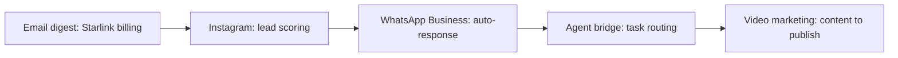

Session: client_demo
Events: 5

Storyline:
  1. Email digest: Starlink billing [gmail / Daily digest]
  2. Instagram: lead scoring [instagram / Comments and followers]
  3. WhatsApp Business: auto-response [whatsapp / Webhook]
  4. Agent bridge: task routing [bridge / Task queue]
  5. Video marketing: content to publish [video / Training pipeline]

Timeline:
## 1. Email digest: Starlink billing
- ID: email_digest_starlink
- Channel: gmail
- Source: Daily digest
- Summary: The daily email digest groups billing alerts and surfaces the most urgent item first.

Steps:
  1.1 [fetch] open IMAP cache — The engine reads the inbox and cached summaries.
  1.2 [group] categorize — Emails are clustered into billing, social, and other buckets.
  1.3 [rank] surface urgency — The Starlink billing alert is raised above the rest.
  1.4 [notify] send digest — Telegram receives a compact digest for the operator.

Telegram:
  - Daily digest ready
  - Top item: Starlink billing alert
  - Other items grouped into AI/APIs, social, and misc

Voice:
  Daily digest ready. Top item is a Starlink billing alert.

Next:
  - Open the billing thread
  - Reply or defer with a reminder

## 2. Instagram: lead scoring
- ID: instagram_lead_scoring
- Channel: instagram
- Source: Comments and followers
- Summary: An Instagram comment is scored, profiled, and promoted into the lead pipeline.

Steps:
  2.1 [capture] detect new engagement — A new comment or follower event is observed.
  2.2 [profile] scrape profile — Public profile details are read for lead scoring.
  2.3 [score] classify hotness — The lead is scored as cold, warm, or hot.
  2.4 [persist] append lead record — The lead is written to the leads ledger.
  2.5 [notify] telegram summary — The operator gets a short lead brief.

Telegram:
  - New Instagram lead
  - Profile scored and classified
  - Suggested next step: reply or nurture

Voice:
  New Instagram lead scored and classified. Suggested next step is reply or nurture.

Next:
  - Review lead score
  - Send a personalized reply if score is high
  - Add to nurture sequence

## 3. WhatsApp Business: auto-response
- ID: whatsapp_business_autoresponse
- Channel: whatsapp
- Source: Webhook
- Summary: A WhatsApp webhook receives a reservation question and returns a structured auto-response.

Steps:
  3.1 [receive] webhook POST — Meta delivers a new WhatsApp message to the webhook.
  3.2 [classify] detect intent — The message is marked as reservation, price, location, or schedule.
  3.3 [answer] compose response — A structured answer is prepared from canned templates.
  3.4 [send] reply via API — The response is sent back over the Graph API.
  3.5 [log] save lead — The conversation is stored in the lead log.

Telegram:
  - WhatsApp webhook triggered
  - Intent: reservation
  - Auto-response sent from template

Voice:
  WhatsApp webhook triggered. Reservation intent. Auto-response sent from template.

Next:
  - Inspect the conversation log
  - Escalate to manual review if needed

## 4. Agent bridge: task routing
- ID: bridge_task_routing
- Channel: bridge
- Source: Task queue
- Summary: The agent bridge routes a task to code, UI, or auto repair depending on the content.

Steps:
  4.1 [enqueue] receive task — A task is written to the shared queue.
  4.2 [classify] route by keywords — The bridge decides between code, UI, or auto repair.
  4.3 [dispatch] select executor — OpenCode or OpenClaw gets the work.
  4.4 [report] write result — The outcome is stored back into the bridge folder.

Telegram:
  - Bridge task accepted
  - Route selected based on task type
  - Result written to the shared queue

Voice:
  Bridge task accepted. Route selected based on task type.

Next:
  - Inspect the result file
  - Retry with a narrower task if needed

## 5. Video marketing: content to publish
- ID: video_marketing_pipeline
- Channel: video
- Source: Training pipeline
- Summary: A marketing asset becomes a video draft, then a ready-to-post deliverable.

Steps:
  5.1 [ingest] load source asset — An image or clip enters the training pipeline.
  5.2 [generate] produce variations — The system creates crops, pans, captions, or edits.
  5.3 [review] prepare deliverable — Ready-to-post assets are generated.
  5.4 [publish] post or queue — The item can be posted or staged for approval.

Telegram:
  - Video asset processed
  - Ready-to-post deliverable generated
  - Suggested next step: review and publish

Voice:
  Video asset processed. Ready-to-post deliverable generated.

Next:
  - Check the output folder
  - Approve for publishing

Mermaid:

